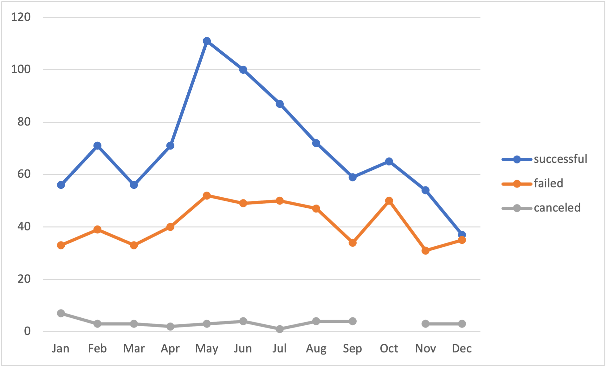
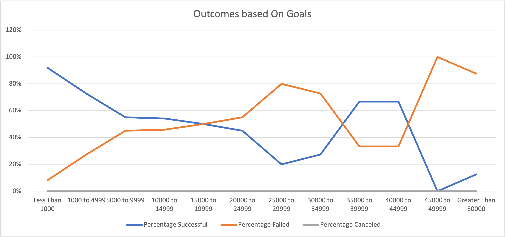

# Kickstarter Analysis

## Overview of Project
Performing an analysis on Kickstarter data to uncover trends

### Purpose
The purpose of this analysis was to help Louise find out how her campaigns fundraising goal and launch date performed in comparison to other campaigns fundraising goals and launch dates.

## Analysis and Challenges

### Analysis of Outcomes Based on Launch Date

### Analysis of Outcomes Based on Goals

### Challenges and Difficulties Encountered
The only difficulty that I did encounter was a division error with the pledge column and no backers column while using the ROUND function. Some data witin those columns had a numerical value of 0 and the error would pop up because 0 is not divisble by 0. I overcame this diffculty by using a function called IFERROR in conjunction with the ROUND function this allowed me to catch errors and replace them with my own input.

## Results
  Based on my analysis of Theater Outcomes based launch date, I can conclude that campigns starting in May and June are the most succesful. I can also conclude that campigns launched in are the least succesful.
  Based on my analysis of Outcomes based on goals, campigns with a goal of $45,000 and up are most likely to fail. 
  A limitation of this dataset is the lack of data on marketing efforts. Information on marketing efforts could provide a better explaination on why some campaigns with the same goals and launch dates did not do as well as others. 
  A reccomendation of another chart and graph we could create, is a bar chart of  Outcomes based length of campaigns.
